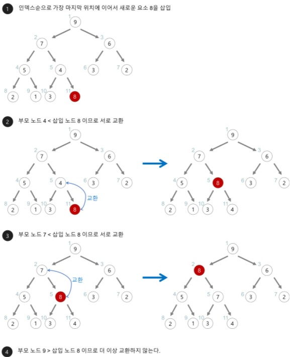
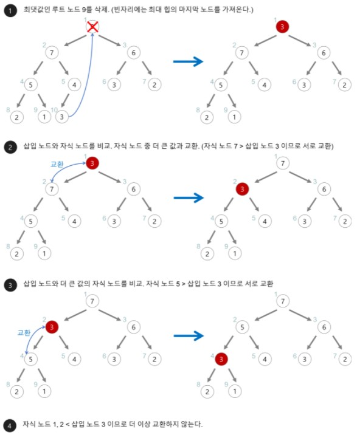

## Heap

- Priority Queue가 Heap을 통해 구현이 된다.
- Heap은 최솟값 또는 최댓값을 빠르게 찾아내기 위해 완전이진트리 형태로 만들어진 자료구조이다.
- Heap Tree에서는 중복된 값을 허용한다.(이진 탐색 트리에서는 중복된 값을 허용하지 않는다.)
- 종류는 최소 힙과 최대 힙이 있으며 우선순위에 따라 오름차순과 내림차순으로 정렬이 된 것이다.
- Heap을 저장하는 표준적인 자료구조는 배열이다. 구현을 쉽게 하기 위하여 배열의 첫 번째 인덱스인 0은 사용되지 않는다.
- 성질
  - 왼쪽 자식 노드 인덱스 = 부모 노드 인덱스 * 2
  - 오른쪽 자식 노드 인덱스 = 부모 노드 인덱스 * 2 + 1
  - 부모 노드 인덱스 = 자식 노드 인덱스 / 2
- 원리
  - add
    1. 인덱스순으로 가장 마지막 위치에 이어서 새로운 요소를 삽입
    2. 부모 노드와 삽입 노드의 키 값을 비교하고 서로 교환(sift-up: 상향선별)을 반복
 

  - remove
    1. 최댓값인 루트 노드를 삭제(빈자리에는 힙의 마지막 노드를 가져온다.)
    2. 자식 노드와 비교. 자식 노드 중 더 큰 값과 교환.(sift-down: 하향선별)을 반복
  

      
