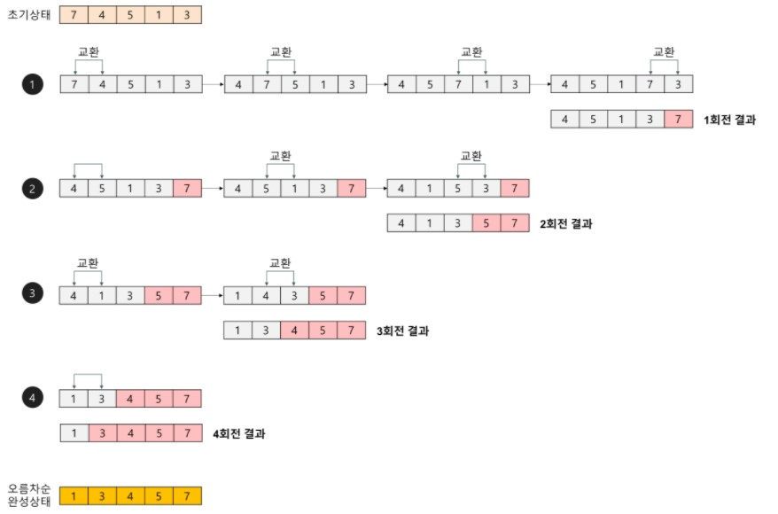
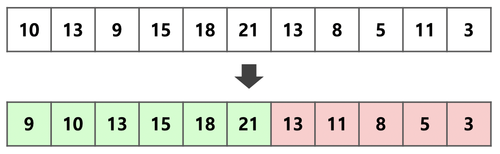
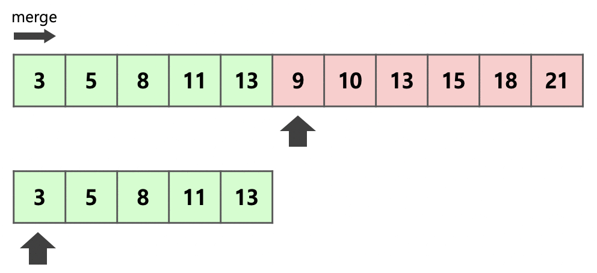
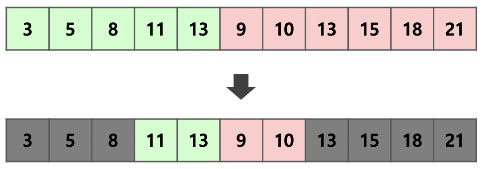
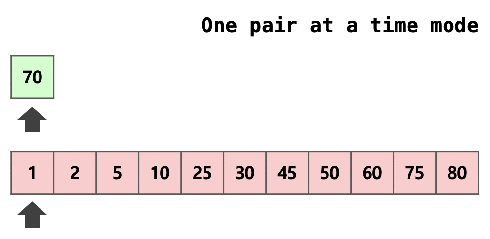

# 정렬

---

### 목차

1. [Selection Sort](#selection-sort)

2. [Bubble Sort](#bubble-sort)

3. [Insertion Sort](#insertion-sort)

4. [Merge Sort](#merge-sort)

5. [Heap Sort](#heap-sort)

6. [Quick Sort](#quick-sort)

7. [Tim Sort](#tim-sort)

8. [Counting Sort](#counting-sort)   

---

| 이름             | 최선         | 평균         | 최악         | 메모리       | 안정  |
|:--------------:|:----------:|:----------:|:----------:|:---------:|:---:|
| Bubble sort    | O(N) | O(N^2)  | O(N^2)  | O(1)    | O   |
| Insertion sort | O(N)     | O(N^2)   | O(N^2)   | O(1)    | O   |
| Heap sort      | O(N)     |O(NlogN) | O(NlogN) | O(1)    | X   |
| Merge sort     | O(NlogN) | O(NlogN) | O(NlogN) | O(N)    | O   |
| Quick sort     | O(NlogN) | O(NlogN) | O(N^2)   | O(logN) | X   |

---

### Selection Sort

> - Time Comlexity : O(N^2)
> 
> - Space Complexity : O(N)
>   
> 1. 인덱스의 가장 앞에서부터, 그 이후의 배열값 중 가장 작은 값을 찾는다.
> 2. 가장 작은 값을 찾으면, 그 값을 현재 인덱스의 값과 바꿔준다.
> 3. 다음 인덱스에서 위 과정을 반복해준다.  

---

### Bubble Sort

> - Time Complexity : O(N^2)  
> 
> - Space Complexity : O(N)
>   
> 1. 삽입 정렬은 두 번째 인덱스부터 시작한다. 현재 인덱스 값과, 바로 이전의 인덱스 값을 비교한다.
> 2. 만약 이전 인덱스 값이 더 크면, 현재 인덱스의 값과 바꿔준다.
> 3. 현재 인덱스가 더 크면, 교환하지 않고 다음 두 연속된 배열값을 비교한다.
> 4. 이를 (전체 배열의 크기 - 현재까지 순환한 바퀴 수)만큼 반복한다

---

### Insertion Sort

> - Time Complexity : O(N^2) ~ O(N)(이미 정렬된 경우)
> 
> - Space Complexity : O(N)
>   
> 1. 두 번째 인덱스부터 시작한다. 현재 인덱스는 별도의 변수에 저장해주고, 비교 인덱스를 현재 인덱스 -1로 잡는다.
> 2. 별도로 저장해 둔 삽입을 위한 변수와 비교 인덱스의 배열 값을 비교한다.
> 3. 삽입 변수의 값이 더 작으면 현재 인덱스로 비교 인덱스의 값을 저장해주고, 비교 인덱스를 -1하여 비교를 반복한다.
> 4. 만약 삽입 변수가 더 크면, 비교 인덱스+1에 삽입 변수를 저장한다.

---

### Merge Sort

> - Time Complexity : O(NlogN)
> 
> - Space Complexity : O(2N)
>   
> 1. 현재 배열을 반으로 쪼갠다. 배열의 시작 위치와 종료 위치를 입력 받아 둘을 더한 후 2를 나눠 그 위치를 기준으로 나눈다.
> 2. 이를 쪼갠 배열의 크기가 0이거나 1일때까지 반복한다.
>   
>   ---
>   
> 1. 두 배열 A, B의 크기를 비교한다. 각각의 배열의 현재 인덱스를 i, j로 가정하자.
> 2. i에는 A 배열의 시작 인덱스를 저장하고, j에는 B 배열의 시작 인덱스를 저장한다.
> 3. A[i]와 B[j]를 비교한다. 오름차순의 경우 이 중에 작은 값을 새 배열 C에 저장한다. A[i]가 더 컸다면 A[i]의 값을 배열 C에 저장해주고, i의 값을 하나 증가시켜 준다.
> 4. 이를 i나 j 둘 중 하나가 각자 배열의 끝에 도달할 때까지 반복한다.
> 5. 끝까지 저장을 못한 배열의 값을 순서대로 전부 다 C에 저장한다.
> 6. C 배열을 원래의 배열에 저장해준다.

---

### Heap Sort

> - Time Complexity : O(NlogN)
>   
> 1. 원소들을 전부 힙에 삽입한다.
> 2. 힙의 루트에 있는 값은 남은 수들 중에서 최솟값(혹은 최댓값)을 가지므로 루트를 출력하고 힙에서 제거한다.
> 3. 힙이 빌 때까지 2의 과정을 반복한다.

---

### Quick Sort

> - Time Complexity : O(NlogN) ~ O(N^2)(이미 정렬된 배열의 경우)
> 
> - Space Complexity : O(N)
>   
> 1. pivot point로 잡을 배열의 값 하나를 정한다. 보통 맨 앞이나 맨 뒤, 혹은 전체 배열 값 중 중간값이나 랜덤값으로 정한다.
> 2. 분할을 진행하기에 앞서서, 가장 왼쪽 배열의 인덱스를 저장하는 left변수, 가장 오른쪽 배열의 인덱스를 저장하는 right변수를 생성한다.
> 3. right부터 비교를 진행한다. 비교는 right가 left보다 클 때만 반복하며, 비교한 배열값이 pivot point보다 크면 right를 하나 감소시키고 pivot point보다 작은 배열 값을 찾으면, 반복을 중지한다.
> 4. 그 다음 left부터 비교를 진행한다. 비교는 right가 left보다 클 때만 반복하며, 비교한 배열값이 pivot point보다 작으면 left를 하나 증가시키고 비교를 반복한다. pivot point보다 큰 배열 값을 찾으면 반복을 중지한다.
> 5. left 인덱스의 값과 right 인덱스의 값을 바꿔준다.
> 6. 3, 4, 5 과정을 left < right가 만족할때까지 반복한다.
> 7. 위 과정이 끝나면 left의 값과 pivot point를 바꿔준다.
> 8. 맨 왼쪽부터 left - 1 까지, left + 1 부터 맨 오른쪽까지로 나눠 퀵 정렬을 반복한다.

---

### Tim Sort

> - Time Complexity : O(N)(이미 정렬된 배열) ~ O(NlogN)
>   
>   Merge sort + Insertion sort
>   Insertion sort의 경우 인접한 메모리와의 비교를 반복하기에 참조 지역성이 높다. 따라서 작은 N에 대해서는 Insertion sort가 빠르다.
>   위를 이용하여 전체를 작은 덩어리로 잘라서 각각의 덩어리를 Insertion sort로 정렬한 뒤 병합하면 빠를 것이라는 아이디어이다.
>   배열을 2^2개씩 덩어리로 자른다고 가정한다. 맨 앞의 두 원소가 [10, 13]으로 증가하고 있으므로 이 덩어리는 증가하는 원소가 담긴 덩어리이다. 9와 15가 순차적으로 이 덩어리에 삽입되고 [9, 10, 13, 15]로 정렬된다. 여기서 멈추지 않고 최대한 덩어리를 크게 만들기 위하여, 뒤의 원소 또한 증가한다면 이 덩어리에 포함시킨다. 이 배열에서 [18, 21]의 경우 이어지는 증가하는 원소들이므로 같은 덩어리로 묶는다. 이 때는 Insertion sort를 사용하지 않고 앞 원소와의 대소만 비교하면 된다.
>   13부터는 새로운 덩어리로 만든다. 덩어리의 첫 두 원소가 [13, 8]으로 감소하고 있으므로 이 덩어리는 감소하는 방향으로 정렬을 진행한다. 앞 네 개의 원소가 [13, 11, 8 ,5]로 정렬되며 뒤의 [3] 또한 감소하기에 같은 덩어리에 포함될 수 있다는 것을 알 수 있다.
>   이러한 덩어리를 run이라고 부르며 이 때의 2^x를 minrun이라 칭한다. 이미 정렬된 배열에서는 하나의 run만 생성되기에 Time Complexity가 O(N)이 되는 것이다. minrun의 크기는 보통 min(N, 2^5 ~ 2^6)로 정의한다.
>   스택에 run을 담아 병합을 진행하는데, 효율을 위해 비슷한 크기의 run끼리 병합을 진행하는 것이 좋다. 따라서 스택에 push를 할 때, 이미 push된 -1, -2 run과 크기를 비교하여 가장 작다면 그대로 push, 가장 작지 않다면 -2 run과 병합을 진행한다.
>   두 개의 run 중 크기가 더 작은 run을 복사한다. 이후 각 run의 시작부분부터 크기 비교를 하여 작은 순서대로 앞을 채우면서 병합을 진행한다.
>   run A의 맨 앞 원소 [3, 5, 8]은 run B의 맨 앞 원소인 9보다 작기 때문에 병합을 수행하지 않고 현재 위치에 있어도 문제가 되지 않는다.
>   run B의 맨 뒤 원소 [13, 15, 18, 21]은 run A의 맨 뒤 원소인 13보다 같거나 크기 때문에 병합을 수행할 필요가 없다.
>   [11, 13], [9, 10] 이렇게 두 부분 run만 병합을 진행하면 되기에 연산량과 메모리가 적게 든다. Binary Search는 O(logK)의 추가 시간이 소요되지만, 늘어날 확률보다 시간이 줄어들 확률이 더 크기때문에 최적화 방법으로 사용된다.
>   화살표가 하나의 run에서 3번 연속 이동할 때에 Galloping Mode로 전환된다. 이 모드에서는 1, 2, ... , 2^k로 뛰어 넘으며 대소 비교를 진행한다.

---

### Counting Sort

> - Time Complexity : O(n+k)(k는 데이터의 **최댓값**을 의미한다)
>   
> 1. 자료를 탐색해서 그 최댓값을 구한다.
>      - _input_ = [1, 5, 4, 6, 3, 7, 8, 9, 10, 2]
>      - _최댓값_ : k = 10
> 2. k + 1만큼의 크기로 모든 자료가 0으로 초기화된 배열을 생성한다.
>      - _counts_ = [0, 0, 0, 0, 0, 0, 0, 0, 0, 0, 0] (11개)
> 3. _input_ 의 모든 원소 n에 대하여 _counts_ 의 n에 대응하는 곳에 +1을 해준다.
>      - _counts_ = [0, 1, 1 ,1 ,1 ,1 ,1 ,1 ,1 ,1 ,1]
>      - 이때 _counts_[n]은 배열 _input_ 에 n이 몇 개 있는지를 의미한다.
> 4. _counts_[i] += _counts_[i-1]의 점화식을 1부터 k의 위치까지 행한다.
>      - _counts_ = [0, 1, 2, 3, 4, 5, 6, 7, 8, 9, 10]
>      - 이때 _counts_[n]은 배열 _input_ 에 n이 몇 개 있는지를 의미한다.
> 5. 길이가 _couints_[k]인 배열을 하나 더 생성한다.
>      - _ans_ = [\0, \0, \0, \0, \0, \0, \0, \0, \0, \0] (10개, null)
> 6. _counts_  _input_[n]에 대응하는 곳의 원소를 찾아서 t로 놓는다. 이제 _ans_ 의 t-1에 대응하는 곳에 _input_[0]을 저장하고, _counts_ 의 _input_[0]에 대응하는 곳의 값은 -1해준다.
>      - 1이 주어짐
>      - _counts_[1] = 1
>      - 대응하는 값인 1 - 1 = 0의 위치에 1을 삽입
>      - _ans_ = [1, \0, \0, \0, \0, \0, \0, \0, \0, \0]
>      - _counts_ 는 [0, 1, 2, 3, 4, 5, 6, 7, 8, 9, 10] 에서 [0, 0, 2, 3, 4, 5, 6, 7, 8, 9, 10] 로 바뀜
> 7.  6의 과정을 남아 있는 자료에 대하여 반복한다.
>      - 5가 주어짐
>      - _counts_[5] = 5
>      - 대응하는 값인 5 - 1 = 4의 위치에 5를 삽입
>      - _ans_ = [1, \0, \0, \0, 5, \0, \0, \0, \0, \0]
>      - _counts_ 는 [0, 1, 2, 3, 4, 5, 6, 7, 8, 9, 10] 에서 [0, 0, 2, 3, 4, 4, 6, 7, 8, 9, 10] 로 바뀜
> 8. 이런 식으로 n개의 자료를 모두 조사하면 [1, 2, 3, 4, 5, 6, 7, 8, 9, 10] 순서로 정렬이 된다.  

---
=======
## 정렬

### 목차
1. [Selection Sort](#selection-sort)
2. [Bubble Sort](#bubble-sort)
3. [Insertion Sort](#insertion-sort)
4. [Merge Sort](#merge-sort)
5. [Heap Sort](#heap-sort)
6. [Quick Sort](#quick-sort)
7. [Tim Sort](#tim-sort)
8. [Counting Sort](#counting-sort)  

### Selection Sort
- Time Comlexity : O(N^2)
- Space Complexity : O(N)

1. 인덱스의 가장 앞에서부터, 그 이후의 배열값 중 가장 작은 값을 찾는다.
2. 가장 작은 값을 찾으면, 그 값을 현재 인덱스의 값과 바꿔준다.
3. 다음 인덱스에서 위 과정을 반복해준다.

### Bubble Sort
- Time Complexity : O(N^2)  
- Space Complexity : O(N)

1. 삽입 정렬은 두 번째 인덱스부터 시작한다. 현재 인덱스 값과, 바로 이전의 인덱스 값을 비교한다.
2. 만약 이전 인덱스 값이 더 크면, 현재 인덱스의 값과 바꿔준다.
3. 현재 인덱스가 더 크면, 교환하지 않고 다음 두 연속된 배열값을 비교한다.
4. 이를 (전체 배열의 크기 - 현재까지 순환한 바퀴 수)만큼 반복한다

